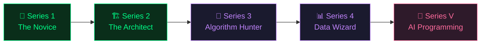

<p align="center">
  
</p>

<p align="center">
  <a href="https://www.hoppypy.com"></a>
  <a href="https://www.hoppypy.com/en/courses"></a>
  <a href="./README_zh.md"></a>
</p>

<p align="center">
  
  
  
  
  <a href="./cheatsheet.md"></a>
</p>

---

# 🐸 HoppyPy — Learn Python & AI the Hoppy Way

> **Forget installations. Forget boring lectures. Just open your browser and start coding.**

HoppyPy is a **100% free**, gamified, interactive platform designed for **absolute beginners** to learn Python and AI programming — right in the browser, no setup required.

> [!TIP]
> **🤖 NEW: [Vibe Coding Prompt Templates](./vibe-coding)** — A curated collection of copy-paste prompts for AI-Native IDEs. Build web apps, automate tasks, and create AI agents — all with natural language. _Inspired by Andrej Karpathy's Vibe Coding philosophy._

<br/>

## ✨ Why HoppyPy?

|     | Feature                                       | Description                                                       |
| --- | --------------------------------------------- | ----------------------------------------------------------------- |
| 🎮  | **Gamified Learning**                         | Progress through themed adventures, earn XP, level up your skills |
| 🌐  | **Browser-Based**                             | No installation. No environment setup. Just click and code        |
| 🤖  | **AI Programming**                            | Learn to orchestrate LLMs and build agents from day one           |
| 🆓  | **100% Free**                                 | No paywalls, no premium tiers. Quality education for everyone     |
| 🌍  | **Bilingual**                                 | Full English + Chinese support                                    |
| ⚡  | **Interactive Sandbox**                       | Write, run, and experiment with real Python code instantly        |
| 📝  | **[Prompt Templates](./vibe-coding/prompts)** | Ready-to-use Vibe Coding prompts for AI-Native IDEs               |

<br/>

## 🗺️ Learning Path

A structured journey from zero to Python + AI proficiency:



| Series | Title               | What You'll Learn                     |                                                                               |
| ------ | ------------------- | ------------------------------------- | ----------------------------------------------------------------------------- |
| **1**  | 🌱 The Novice       | Variables, strings, loops, conditions | [Start →](https://www.hoppypy.com/en/learn/python-basics/01-hoppy-speaks)     |
| **2**  | 🏗️ The Architect    | Functions, modules, file handling     | [Start →](https://www.hoppypy.com/en/learn/python-architect/00-the-workshop)  |
| **3**  | 🧩 Algorithm Hunter | Data structures, recursion, sorting   | 🔜 Coming Soon                                                                |
| **4**  | 📊 Data Wizard      | Pandas, Matplotlib, data analysis     | 🔜 Coming Soon                                                                |
| **V**  | 🤖 AI Programming   | LLM orchestration, agents, 10x dev    | [Start →](https://www.hoppypy.com/en/learn/python-vibe/01-choose-your-weapon) |

<br/>

## 💻 Code Examples

Get a taste of what you'll learn. All examples are runnable — try them out!

### 🌱 Hello Hoppy (Series 1)

```python
# Your first Python script — meet Hoppy! 🐸
name = "Hoppy"
level = 1
skills = ["print()", "variables", "f-strings"]

print(f"🐸 Hi! I'm {name}, Level {level}")
print(f"🛡️ Skills: {', '.join(skills)}")

# Hoppy's ASCII art
print("""
    @..@
   (----)
  ( >__< )
  ^^ ~~ ^^
""")
```

### 🏗️ Data Structures (Series 2)

```python
# Build a quest system with lists and dicts 🗺️
quests = [
    {"name": "Print your first line", "reward": 100, "done": True},
    {"name": "Build a to-do list",    "reward": 500, "done": False},
]

completed = [q for q in quests if q["done"]]
total_xp = sum(q["reward"] for q in completed)
print(f"📈 Progress: {len(completed)}/{len(quests)} | 💰 XP: {total_xp}")
```

### 🤖 AI Programming (Series V)

```python
# Orchestrate AI agents to build apps 🚀
# This is what "Vibe Coding" looks like

from langchain import ChatOpenAI, PromptTemplate

agent = ChatOpenAI(model="gpt-4")
prompt = PromptTemplate("Analyze this data: {data}")

# One prompt, infinite possibilities
result = agent.invoke(prompt.format(data=sales_report))
```

> 📂 More complete examples in the [`examples/`](./examples) directory

<br/>

## 🎮 Try the Adventure Game!

Want something fun? Hoppy has a **terminal RPG adventure** where you fight Bug monsters with Python knowledge!

```bash
python examples/hoppy_adventure.py
```

> 🐛 3 boss battles • 12 questions • hint system • score tracking

<br/>

## 📋 Python Cheatsheet

We also have a **bilingual Python cheatsheet** — perfect for quick reference!

➡️ [View the Cheatsheet](./cheatsheet.md)

<br/>

## 🚀 Quick Start

No installation needed! Just visit **[hoppypy.com](https://www.hoppypy.com)** and start learning.

Want to run the examples locally?

```bash
# Clone this repo
git clone https://github.com/hoppy-py/hoppypy.git
cd hoppypy

# Run an example
python examples/01_hello_hoppy.py

# Or play the adventure game!
python examples/hoppy_adventure.py
```

<br/>

## 🌟 Why Python?

<table>
<tr>
<td width="25%" align="center">
<h4>🤖 AI Superpowers</h4>
<p>Don't watch the AI revolution — lead it. Control LLMs and build smart assistants.</p>
</td>
<td width="25%" align="center">
<h4>⚡ Automate Everything</h4>
<p>Turn hours of Excel copy-pasting into a 3-second script.</p>
</td>
<td width="25%" align="center">
<h4>📊 Data Insights</h4>
<p>Transform messy spreadsheets into clear, stunning visualizations.</p>
</td>
<td width="25%" align="center">
<h4>🛠️ Create, Don't Consume</h4>
<p>Build tools, websites, and games that solve real problems.</p>
</td>
</tr>
</table>

<br/>

## 🤝 Contributing

We welcome contributions! Whether it's fixing typos, adding examples, or suggesting new lessons.

See [CONTRIBUTING.md](./CONTRIBUTING.md) for details.

<br/>

## 📄 License

This project is licensed under the [MIT License](./LICENSE).

---

<p align="center">
  <b>Ready to start your Python journey?</b><br/>
  <a href="https://www.hoppypy.com">
    
  </a>
</p>

<p align="center">
  Made with 💚 by the HoppyPy Team<br/>
  <sub>If you find this helpful, please ⭐ star this repo — it helps more people discover free Python education!</sub>
</p>
