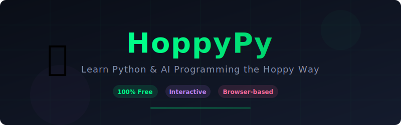
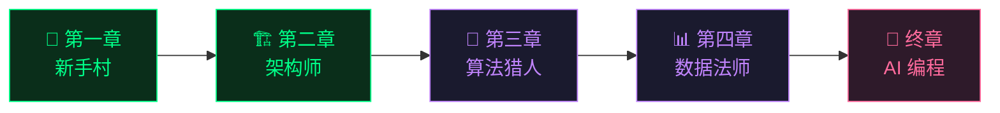

<p align="center">
  
</p>

<p align="center">
  <a href="https://www.hoppypy.com/zh"></a>
  <a href="https://www.hoppypy.com/zh/courses"></a>
  <a href="./README.md"></a>
</p>

<p align="center">
  
  
  
  
  <a href="./cheatsheet.md"></a>
</p>

---

# 🐸 HoppyPy — 像玩游戏一样学 Python 和 AI

> **忘掉安装、忘掉环境配置、忘掉枯燥的视频课。打开浏览器，直接开始敲代码。**

HoppyPy 是一个 **完全免费** 的游戏化互动编程学习平台，专为 **零基础** 学习者设计 —— 在浏览器中直接学习 Python 和 AI 编程，无需任何安装。

> [!TIP]
> **🤖 新上线：[Vibe Coding Prompt 模板库](./vibe-coding)** — 精心整理的 AI 原生 IDE 实用 Prompt，复制粘贴即可用。用自然语言构建 Web 应用、自动化任务、创建 AI 智能体。_灵感来自 Andrej Karpathy 的 Vibe Coding 哲学。_

<br/>

## ✨ 为什么选择 HoppyPy？

|     | 特性                                       | 描述                                                  |
| --- | ------------------------------------------ | ----------------------------------------------------- | --- |
| 🎮  | **游戏化学习**                             | 跟着冒险故事线推进，收集经验值，解锁新技能            |
| 🌐  | **浏览器即开即学**                         | 无需安装 Python，无需配置环境，点击就能写代码         |
| 🤖  | **AI 编程实战**                            | 从入门就学会操控大模型，构建 AI 智能体                |
| 🆓  | **100% 免费**                              | 没有付费墙，没有高级会员。好的教育应该免费            |
| 🌍  | **中英双语**                               | 完整的中文 + 英文支持                                 |
| ⚡  | **互动沙箱**                               | 实时编写、运行、试验真正的 Python 代码                |
| 📝  | **[Prompt 模板库](./vibe-coding/prompts)** | 现成的 Vibe Coding Prompt，复制粘贴到 AI IDE 即可使用 |     |

<br/>

## 🗺️ 学习路线

从零开始，一路进阶到 Python + AI 全栈能力：



| 系列  | 标题        | 你将学到                           |                                                                              |
| ----- | ----------- | ---------------------------------- | ---------------------------------------------------------------------------- |
| **1** | 🌱 新手村   | 变量、字符串、循环、条件判断       | [开始 →](https://www.hoppypy.com/zh/learn/python-basics/01-hoppy-speaks)     |
| **2** | 🏗️ 架构师   | 函数、模块、文件读写               | [开始 →](https://www.hoppypy.com/zh/learn/python-architect/00-the-workshop)  |
| **3** | 🧩 算法猎人 | 数据结构、递归、排序算法           | 🔜 即将推出                                                                  |
| **4** | 📊 数据法师 | Pandas、Matplotlib、数据分析       | 🔜 即将推出                                                                  |
| **V** | 🤖 AI 编程  | 大模型编排、Agent 构建、10x 生产力 | [开始 →](https://www.hoppypy.com/zh/learn/python-vibe/01-choose-your-weapon) |

<br/>

## 💻 代码示例

感受一下你将要学到的东西。所有示例都可以直接运行！

### 🌱 Hello Hoppy（第一章预览）

```python
# 你的第一个 Python 脚本 —— 遇见 Hoppy！🐸
name = "Hoppy"
level = 1
skills = ["print()", "变量", "f-string"]

print(f"🐸 你好！我是 {name}，等级 {level}")
print(f"🛡️ 技能: {', '.join(skills)}")

# Hoppy 的 ASCII 艺术
print("""
    @..@
   (----)
  ( >__< )
  ^^ ~~ ^^
""")
```

### 🏗️ 数据结构（第二章预览）

```python
# 用列表和字典构建任务系统 🗺️
quests = [
    {"name": "打印你的第一行代码", "reward": 100, "done": True},
    {"name": "构建待办事项列表",   "reward": 500, "done": False},
]

completed = [q for q in quests if q["done"]]
total_xp = sum(q["reward"] for q in completed)
print(f"📈 进度: {len(completed)}/{len(quests)} | 💰 经验值: {total_xp}")
```

### 🤖 AI 编程（终章预览）

```python
# 编排 AI 智能体来构建应用 🚀
# 这就是"氛围编程 (Vibe Coding)"的样子

from langchain import ChatOpenAI, PromptTemplate

agent = ChatOpenAI(model="gpt-4")
prompt = PromptTemplate("分析这份数据: {data}")

# 一个提示词，无限可能
result = agent.invoke(prompt.format(data=sales_report))
```

> 📂 更多完整示例请查看 [`examples/`](./examples) 目录

<br/>

## 🎮 来玩冒险游戏！

想来点不一样的？Hoppy 准备了一个 **终端 RPG 冒险游戏**，用 Python 知识击败 Bug 怪兽！

```bash
python examples/hoppy_adventure.py
```

> 🐛 3 场 Boss 战 • 12 道编程题 • 提示系统 • 得分排名

<br/>

## � Python 速查表

我们还准备了一份 **中英双语 Python 速查表** —— 随时查阅的利器！

➡️ [查看速查表](./cheatsheet.md)

<br/>

## �🚀 快速开始

无需安装任何东西！直接访问 **[hoppypy.com](https://www.hoppypy.com/zh)** 开始学习。

想在本地运行示例？

```bash
# 克隆这个仓库
git clone https://github.com/gdgd8760/hoppypy-repo.git
cd hoppypy-repo

# 运行示例
python examples/01_hello_hoppy.py

# 或者玩冒险游戏！
python examples/hoppy_adventure.py
```

<br/>

## 🌟 为什么学 Python？

<table>
<tr>
<td width="25%" align="center">
<h4>🤖 AI 时代超能力</h4>
<p>别只是旁观 AI 革命——学会掌控大模型，打造属于你的智能助手。</p>
</td>
<td width="25%" align="center">
<h4>⚡ 告别无效加班</h4>
<p>把几小时的 Excel 复制粘贴变成 3 秒钟的脚本。拒绝机械重复。</p>
</td>
<td width="25%" align="center">
<h4>📊 数据洞察力</h4>
<p>将杂乱的表格转化为清晰的可视化图表。用数据说话。</p>
</td>
<td width="25%" align="center">
<h4>🛠️ 创造而不是消费</h4>
<p>把脑洞变成现实。亲手开发工具或网站，解决真实痛点。</p>
</td>
</tr>
</table>

<br/>

## 🤝 参与贡献

我们欢迎一切形式的贡献！无论是修复错别字、添加示例，还是提出新课程建议。

详情请看 [CONTRIBUTING.md](./CONTRIBUTING.md)。

<br/>

## 📄 许可证

本项目采用 [MIT 许可证](./LICENSE)。

---

<p align="center">
  <b>准备好开始你的 Python 之旅了吗？</b><br/>
  <a href="https://www.hoppypy.com/zh">
    
  </a>
</p>

<p align="center">
  由 HoppyPy 团队用 💚 打造<br/>
  <sub>如果觉得有帮助，请 ⭐ Star 这个仓库 —— 帮助更多人发现免费的 Python 教育资源！</sub>
</p>
